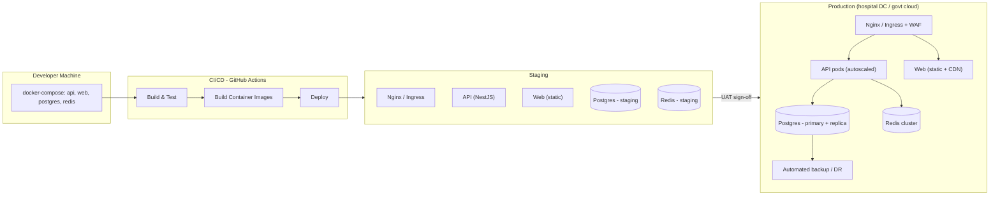
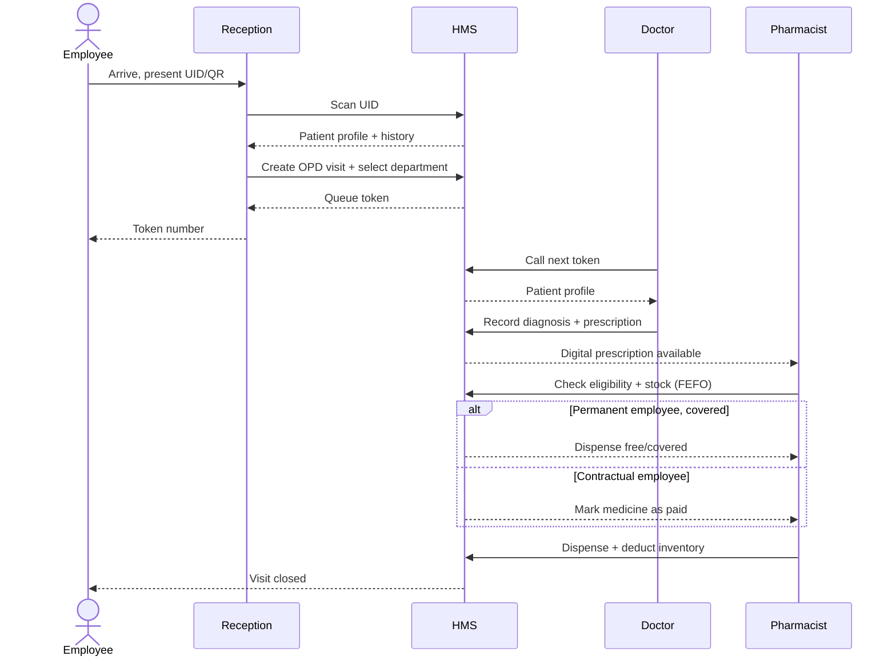
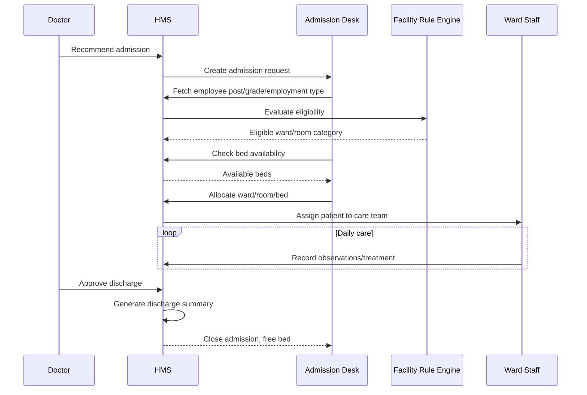
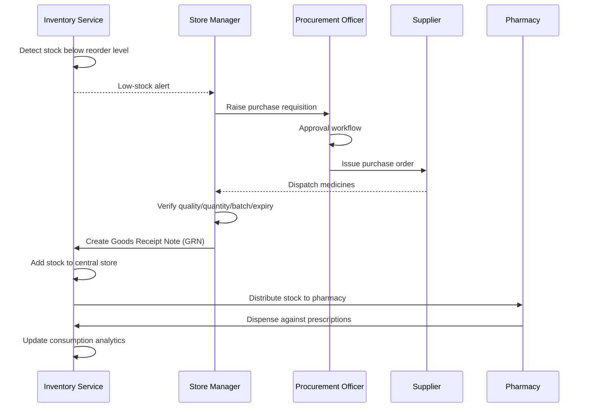
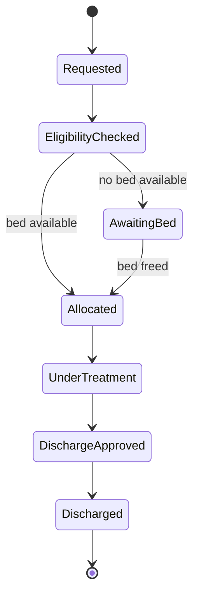
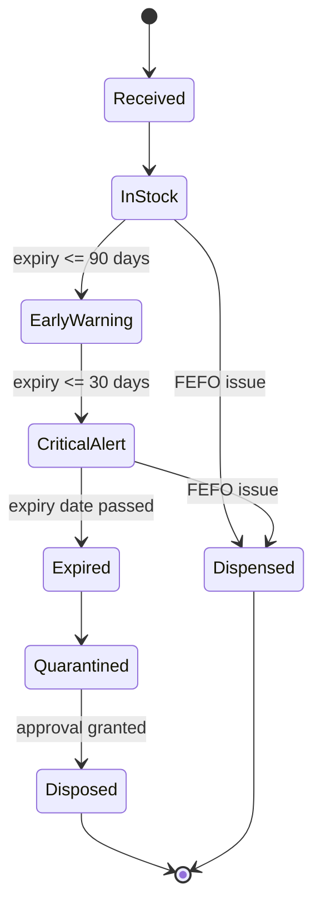

# Architecture

## 1. Architectural principles

These are the ground rules every design decision below follows — stated once here so later sections can
just say "per principle 3" instead of re-arguing it each time.

1. **Start as a modular monolith.** One deployable unit, but internally split into the same modules as
   the recommended software modules list (spec §16). This gives most of the maintainability of
   microservices (clear boundaries, independent testing) without the operational cost (service mesh,
   distributed transactions, network latency between what are really tightly-coupled clinical workflows).
2. **Policy is data, not code.** Facility eligibility and medicine benefit coverage are the two most
   change-prone rules in the whole system (spec §9, §17) — they live in database tables an Administrator
   can edit, never as `if` branches.
3. **Every write that matters is provable.** Inventory deductions and critical actions write append-only
   records. If a dispute arises six months later, the system must be able to answer "what happened."
4. **Correctness under concurrency beats convenience.** Bed allocation and token generation are the two
   places two staff members can act on the same resource at once — both are designed to be safe under
   race conditions from day one, not patched later.
5. **Degrade gracefully, don't go dark.** If the Labour Department API is unreachable, registration falls
   back to a manual-verification case (spec §4.1) instead of blocking the front desk entirely.

## 2. System architecture

```mermaid
graph TB
    subgraph Clients["Client Layer"]
        WebApp["Reception / Doctor / Nurse / Pharmacy Web App"]
        AdminApp["Admin & Analytics Console"]
        KioskQR["UID / QR Kiosk + Card Printer"]
    end

    subgraph Gateway["API Gateway"]
        GW["REST API Gateway + Auth (JWT, RBAC)"]
    end

    subgraph Services["Application Services"]
        EmpSvc["Employee & UID Service"]
        PatSvc["Patient Profile & Visit Service"]
        OPDSvc["OPD Service"]
        IPDSvc["IPD / Admission Service"]
        RuleSvc["Facility Eligibility Rule Engine"]
        DocSvc["Doctor & Prescription Service"]
        PharmSvc["Pharmacy & Dispensing Service"]
        InvSvc["Inventory & Batch Service"]
        ScmSvc["Supply Chain & Procurement Service"]
        BillSvc["Billing & Benefit Service"]
        AuditSvc["Audit & Security Service"]
    end

    subgraph Data["Data Layer"]
        PG[("PostgreSQL - primary store")]
        Redis[("Redis - queue tokens, cache, jobs")]
        FileStore[("Object storage - QR / PDF / reports")]
    end

    subgraph External["External Systems"]
        LaborAPI["Labour Department Employee API"]
        SupplierSys["Supplier / Vendor Systems"]
        NotifySvc["SMS / Email / Print Service"]
    end

    WebApp --> GW
    AdminApp --> GW
    KioskQR --> GW
    GW --> EmpSvc & PatSvc & OPDSvc & IPDSvc & RuleSvc & DocSvc & PharmSvc & InvSvc & ScmSvc & BillSvc
    EmpSvc --> LaborAPI
    ScmSvc --> SupplierSys
    EmpSvc & PatSvc & OPDSvc & IPDSvc & RuleSvc & DocSvc & PharmSvc & InvSvc & ScmSvc & BillSvc --> PG
    OPDSvc --> Redis
    InvSvc --> Redis
    EmpSvc --> FileStore
    DocSvc --> FileStore
    AuditSvc -.observes.-> Services
    AuditSvc --> PG
    PharmSvc --> NotifySvc
    IPDSvc --> NotifySvc
```

### 2.1 Component responsibilities

Every service box above, spelled out: what it owns, what it exposes, and what it depends on. This table
is the single source of truth for "which module does X belong in" during build.

| Service | Owns (entities) | Exposes | Depends on |
|---|---|---|---|
| **Employee & UID Service** | Employee, HospitalUID, EmploymentType, Post, Grade | Verify, register, lookup, UID card | Labour Department API |
| **Patient Profile & Visit Service** | PatientProfile, Visit | Profile lookup, visit creation | Employee & UID Service |
| **OPD Service** | OPDVisit | Department selection, token queue | Visit Service, Redis (token counter) |
| **Doctor & Prescription Service** | Diagnosis, Prescription, PrescriptionItem | Doctor queue, consultation, sign-off | Patient Profile Service, Benefit Rule (via Billing) |
| **Facility Eligibility Rule Engine** | FacilityEligibilityRule | Rule CRUD, eligibility resolution | Employee Service (post/grade) |
| **IPD / Admission Service** | Admission, Ward, Room, Bed | Admission request, allocation, discharge | Facility Rule Engine, Doctor Service |
| **Pharmacy & Dispensing Service** | (reads Prescription, writes StockTransaction) | Dispensing queue, FEFO batch selection, dispense | Inventory Service, Billing Service |
| **Inventory & Batch Service** | Medicine, MedicineBatch, PharmacyStock, StockTransaction | Stock queries, expiry scan, quarantine | — |
| **Supply Chain & Procurement Service** | Supplier, PurchaseRequisition, Approval, PurchaseOrder, GoodsReceiptNote | Requisition, approval, PO, GRN, transfer | Inventory Service |
| **Billing & Benefit Service** | BenefitRule, BillingTransaction | Benefit evaluation, ledger, receipts | — |
| **Audit & Security Service** | AuditLog, User, Role, Permission | Auth, RBAC enforcement, audit writes | Observes all other services |

### 2.2 Why a modular monolith, and when to split it

Split a module into its own deployable service only when **one** of these becomes true — not
speculatively:
- It needs to scale independently at a load the rest of the system doesn't (Pharmacy/Inventory during a
  procurement surge is the most likely first candidate).
- It's owned by a genuinely separate team with its own release cadence.
- It has a hard reliability boundary requirement (e.g., Audit must stay up even if Procurement is down).

Until one of those is true, the modular monolith is strictly simpler to operate, test, and reason about —
one deployment, one transaction boundary for cross-module writes (critical for bed allocation + audit log
in the same transaction), and no distributed-transaction complexity for something as sensitive as
inventory deduction.

### 2.3 API design conventions

- REST over HTTP/JSON, documented with OpenAPI/Swagger (auto-generated from NestJS decorators).
- Resource-oriented paths (`/admissions/:id/allocate`, not `/allocateAdmission`).
- Every mutating endpoint requires an authenticated session and passes through the RBAC guard before
  touching a service.
- List endpoints are paginated by default (`?page=`, `?pageSize=`) — the queue/history endpoints in
  particular can grow large over a hospital's lifetime.
- Errors return a consistent shape: `{ statusCode, error, message, details? }` — never a raw stack trace
  to the client.
- Idempotency: any endpoint that could be double-submitted from a flaky network (registration, dispense,
  bed allocation) either accepts a client-generated idempotency key or is designed to safely reject a
  duplicate at the database constraint level (see `03-data-model.md` §"Key constraints").

### 2.4 Caching & queueing strategy (Redis)

| Use case | Redis pattern | Why Redis and not Postgres |
|---|---|---|
| Daily OPD queue token counter | Atomic `INCR` per `department:date` key | Needs sub-millisecond atomic increment under concurrent reception requests; a DB row would need row-level locking and is slower under this specific access pattern |
| Scheduled jobs (expiry scan, low-stock check) | BullMQ job queue backed by Redis | Reliable retry/backoff semantics out of the box |
| Session/short-lived cache | Standard key-value with TTL | Reduces repeat DB hits for frequently-read, rarely-changed data (e.g., resolved facility eligibility for an active visit) |

Nothing that must survive a Redis restart is stored *only* in Redis — Postgres is always the system of
record; Redis is an accelerator and a job queue.

### 2.5 Error handling & resilience

- **External dependency down (Labour Department API):** registration falls back to the manual-
  verification path (spec §4.1) — the front desk keeps working, just with a slower path for new
  registrations. This is implemented via the `LabourDeptClient` interface (see `02-tech-stack.md`), so the
  fallback logic lives in one place.
- **Partial failure inside a transaction (e.g., stock deducted but audit write fails):** both writes
  happen inside one database transaction — either both succeed or neither does. No "deducted but
  unlogged" state is possible by construction.
- **Concurrent bed allocation:** enforced with a database-level unique constraint (one active admission
  per bed) plus a transaction — the second concurrent request fails cleanly with a "bed no longer
  available" error rather than double-booking.

## 3. Deployment / implementation diagram

### 3.1 Environment progression

| Environment | Purpose | Data | Who can deploy |
|---|---|---|---|
| Local (docker-compose) | Individual development | Seeded fake data | Any developer, any time |
| Staging | Integration testing, UAT sign-off (spec §16 Phase 16) | Sanitized/synthetic data, never real patient data | CI, on merge to main |
| Production | Live hospital operation | Real patient/medicine data | CI, only after explicit UAT sign-off, gated manually |

### 3.2 Sizing note

Kubernetes is drawn above as the production target, but it is **not a requirement** — right-size to the
hospital's actual IT capacity (see `02-tech-stack.md` §"Prod environment"). A single hardened VM running
the same Docker Compose stack with a managed Postgres backup job is a legitimate production deployment for
a single-hospital system at this scale.

## 4. Core workflow sequence diagrams

Each diagram below is followed by a plain-language walkthrough of what's actually happening at each
step — useful when a diagram alone leaves a step ambiguous.

### 4.1 OPD (Out Service) visit

**Walkthrough:** the UID scan is the only "identity" step in the whole flow — everything downstream
(history, token, prescription, benefit rule) resolves from it. The benefit-rule branch (`alt` block) is
evaluated fresh at *dispensing* time, not locked in at prescription time, so a benefit rule change between
consultation and dispensing is applied correctly without needing to re-open the prescription.

### 4.2 IPD (Admission)

**Walkthrough:** eligibility resolution and bed availability are two *separate* checks, deliberately —
being entitled to Category A doesn't guarantee a Category A bed is free right now. The admission desk sees
only beds that pass both filters, so there's no way to allocate an ineligible or already-occupied bed
through the UI. Discharge is gated on doctor approval specifically so ward staff can't independently end
an admission.

### 4.3 Medicine supply chain

**Walkthrough:** notice there are exactly two points where a human makes a judgment call the system can't
automate — the requisition approval, and the physical quality/quantity/batch verification on delivery.
Everything else (detecting low stock, creating batch records from a GRN, updating analytics) is
system-driven. The GRN step is the only place new MedicineBatch records get created, which is what keeps
every unit of stock traceable back to a specific delivery.

## 5. Lifecycle state diagrams

State machines are called out explicitly (rather than left as implicit status strings) for the two
entities where an invalid transition would be a real operational problem.

### 5.1 Admission

Valid transitions only — e.g., there is no path from `Requested` directly to `Allocated` that skips
`EligibilityChecked`, and no path from `UnderTreatment` back to `AwaitingBed`. Enforce this in code with
an explicit state-transition guard (reject any transition not listed above), not by trusting every caller
to set the right next status.

### 5.2 Medicine batch

Note that `Dispensed` is reachable from both `InStock` and `CriticalAlert` — a batch nearing expiry is
still dispensable (and *should* be dispensed first, per FEFO) right up until it actually expires. Only
`Expired` blocks dispensing.

## 6. Security & network zones (summary)

Detailed in `06-requirements.md` (NFR-SEC group) and `07-functional-spec.md` Module 13 — architecturally,
the relevant boundary is:

- **Public zone:** none — this system has no anonymous-access surface. Even the QR/UID kiosk requires an
  authenticated reception session behind it.
- **Application zone:** API + web app, behind TLS termination (Nginx/WAF in the deployment diagram).
- **Data zone:** Postgres + Redis, reachable only from the application zone, never directly from clients
  or the public internet.
- **External zone:** Labour Department API, supplier systems, notification services — accessed only
  through dedicated adapter modules (`LabourDeptClient`, etc.), never called ad-hoc from business logic.
