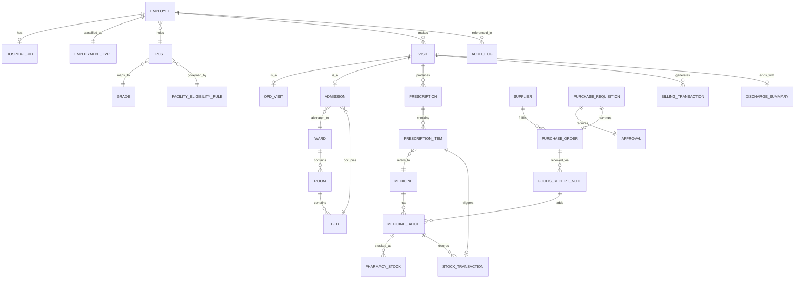

# Data Model

34 entities total: the 33 named in spec §18, plus `User`, `Role` and `Permission` (implied by the RBAC
requirement in spec §17/§20 but not spelled out as data entities in the source doc — added here because
Phase 1 needs them to seed the 9 roles).

This document gives the **full field-level schema** for every entity, grouped by the module that owns
them (matching `01-architecture.md` §2.1). For *why* a field or constraint exists, see
`07-functional-spec.md`, which has the business-rule reasoning; this doc is the *shape*.

Type notation: `uuid`, `string`, `text` (long string), `int`, `decimal`, `boolean`, `date`, `datetime`,
`enum(...)`, `ref → Entity` (foreign key).

---

## 1. Identity & access (RBAC)

### User
| Field | Type | Required | Notes |
|---|---|---|---|
| id | uuid | yes | PK |
| email or staff ID | string | yes | Unique login identifier |
| password hash | string | yes | Never store plaintext (NFR-SEC-03) |
| role | ref → Role | yes | |
| active | boolean | yes | Deactivate instead of delete |
| created at | datetime | system | |

### Role
| Field | Type | Required | Notes |
|---|---|---|---|
| id | uuid | yes | PK |
| name | enum | yes | Reception, Doctor, AdmissionDesk, Nurse, Pharmacist, StoreManager, ProcurementOfficer, Administrator, SuperAdmin |

### Permission
| Field | Type | Required | Notes |
|---|---|---|---|
| id | uuid | yes | PK |
| role | ref → Role | yes | |
| resource | string | yes | e.g. `Prescription` |
| action | enum: create, read, update, sign, dispense, approve, ... | yes | Action vocabulary can extend per resource |

---

## 2. Employee & patient identity

### Employee
| Field | Type | Required | Notes |
|---|---|---|---|
| id | uuid | yes | PK |
| employee_id | string | yes | Official Labour Dept identifier; **unique** |
| name | string | yes | |
| department | string | yes | |
| post_id | ref → Post | yes | Drives facility eligibility |
| grade_id | ref → Grade | yes | Drives facility eligibility |
| employment_type_id | ref → EmploymentType | yes | Drives benefit rules |
| contact_phone | string | no | |
| contact_email | string | no | |
| registration_date | date | system | |

**Constraint:** unique index on `employee_id` — enforced at the database level, not just app validation
(see `01-architecture.md` §2.5 on idempotency).

### HospitalUID
| Field | Type | Required | Notes |
|---|---|---|---|
| id | uuid | yes | PK |
| uid_code | string | yes | The human/QR-readable code, e.g. `ESIC-2026-014823`; **unique**, immutable once issued |
| employee_id | ref → Employee | yes | **One-to-one**, unique |
| qr_payload | string | system | Encoded QR content (typically just `uid_code`) |
| issued_at | datetime | system | |

### EmploymentType
| Field | Type | Required | Notes |
|---|---|---|---|
| id | uuid | yes | PK |
| code | enum: Permanent, Contractual | yes | |

### Post
| Field | Type | Required | Notes |
|---|---|---|---|
| id | uuid | yes | PK |
| title | string | yes | e.g. "Senior Officer", "Clerk" |

### Grade
| Field | Type | Required | Notes |
|---|---|---|---|
| id | uuid | yes | PK |
| pay_level | string | yes | |
| post_id | ref → Post | no | Grades commonly cluster under a post |

### PatientProfile
| Field | Type | Required | Notes |
|---|---|---|---|
| id | uuid | yes | PK |
| employee_id | ref → Employee | yes | One-to-one |
| eligibility_category | string | system | Resolved via FacilityEligibilityRule |
| notes | text | no | Non-clinical administrative notes |

---

## 3. Visits

### Visit
| Field | Type | Required | Notes |
|---|---|---|---|
| id | uuid | yes | PK |
| employee_id | ref → Employee | yes | |
| type | enum: OPD, IPD | yes | Set at creation |
| status | enum: Open, Closed | yes | |
| created_at | datetime | system | |
| closed_at | datetime | no | |

### OPDVisit
| Field | Type | Required | Notes |
|---|---|---|---|
| id | uuid | yes | PK |
| visit_id | ref → Visit | yes | One-to-one |
| department_id | ref → Department | yes | |
| token_number | string | system | Unique per department per day, e.g. `CARDIO-014` |
| called_at | datetime | no | Set when doctor calls the token |
| closed_at | datetime | no | |

### Department
| Field | Type | Required | Notes |
|---|---|---|---|
| id | uuid | yes | PK |
| name | string | yes | e.g. "Cardiology" |

---

## 4. Facility eligibility & admission (IPD)

### FacilityEligibilityRule
| Field | Type | Required | Notes |
|---|---|---|---|
| id | uuid | yes | PK |
| post_id / grade_id | ref | at least one | What this rule matches on |
| category | enum: A, B, C, D, Contractual | yes | |
| ward_eligibility | string | yes | e.g. "Private Ward" |
| room | string | yes | e.g. "Single Room" |
| facility_level | string | yes | e.g. "Premium" |
| active | boolean | yes | Only one active rule per post/grade at a time |
| version | int | system | Incremented on edit; prior versions retained |
| created_by | ref → User | system | Administrator/Super Admin only |

### Ward
| Field | Type | Required | Notes |
|---|---|---|---|
| id | uuid | yes | PK |
| name | string | yes | |
| category | enum: A, B, C, D, Contractual | yes | Matches FacilityEligibilityRule.category |

### Room
| Field | Type | Required | Notes |
|---|---|---|---|
| id | uuid | yes | PK |
| ward_id | ref → Ward | yes | |
| room_number | string | yes | |
| type | enum: Single, Shared, General | yes | |

### Bed
| Field | Type | Required | Notes |
|---|---|---|---|
| id | uuid | yes | PK |
| room_id | ref → Room | yes | |
| bed_number | string | yes | |
| status | enum: Available, Occupied, Maintenance | yes | |
| current_admission_id | ref → Admission, nullable | no | **Unique when non-null** — enforces one active admission per bed |

### Admission
| Field | Type | Required | Notes |
|---|---|---|---|
| id | uuid | yes | PK |
| visit_id | ref → Visit | yes | |
| status | enum: Requested, EligibilityChecked, AwaitingBed, Allocated, UnderTreatment, DischargeApproved, Discharged | yes | See state diagram in `01-architecture.md` §5.1 |
| eligible_category | string | system | From FacilityEligibilityRule resolution |
| bed_id | ref → Bed | set on allocation | |
| assigned_doctor_id | ref → User | set on allocation | |
| assigned_nurse_id | ref → User | set on allocation | |
| requested_at | datetime | system | |
| allocated_at | datetime | no | |
| discharged_at | datetime | no | |

### AdmissionNote (daily observation/treatment)
| Field | Type | Required | Notes |
|---|---|---|---|
| id | uuid | yes | PK |
| admission_id | ref → Admission | yes | |
| authored_by | ref → User | yes | Nurse/Ward Staff |
| note | text | yes | |
| created_at | datetime | system | |

### DischargeSummary
| Field | Type | Required | Notes |
|---|---|---|---|
| id | uuid | yes | PK |
| admission_id | ref → Admission | yes | One-to-one |
| approved_by | ref → User | yes | Doctor role required |
| summary_text | text | yes | |
| generated_at | datetime | system | |

---

## 5. Doctor & prescriptions

### Doctor
| Field | Type | Required | Notes |
|---|---|---|---|
| id | uuid | yes | PK |
| user_id | ref → User | yes | Doctor role |
| department_id | ref → Department | no | Primary department |

### Diagnosis
| Field | Type | Required | Notes |
|---|---|---|---|
| id | uuid | yes | PK |
| visit_id | ref → Visit | yes | |
| doctor_id | ref → Doctor | yes | |
| symptoms | text | no | |
| examination_notes | text | no | |
| diagnosis_text | text | yes | |
| follow_up_flag | boolean | no | |
| admission_recommended | boolean | no | Triggers Admission creation |

### Prescription
| Field | Type | Required | Notes |
|---|---|---|---|
| id | uuid | yes | PK |
| visit_id | ref → Visit | yes | |
| doctor_id | ref → Doctor | yes | Only Doctor role can sign (FR-DOC-07) |
| status | enum: Draft, Signed, PartiallyDispensed, Closed | yes | Draft editable only by author; Signed is immutable |
| signed_at | datetime | no | |

### PrescriptionItem
| Field | Type | Required | Notes |
|---|---|---|---|
| id | uuid | yes | PK |
| prescription_id | ref → Prescription | yes | |
| medicine_id | ref → Medicine | yes | |
| dose | string | yes | e.g. "500mg" |
| frequency | string | yes | e.g. "twice daily" |
| duration | string | yes | e.g. "5 days" |
| benefit_outcome | enum: Free, Covered, Paid | system | Resolved by BenefitRuleService |
| dispense_status | enum: Pending, Dispensed, PartiallyDispensed | yes | |

### LabOrder
| Field | Type | Required | Notes |
|---|---|---|---|
| id | uuid | yes | PK |
| visit_id | ref → Visit | yes | |
| test_name | string | yes | |
| ordered_by | ref → Doctor | yes | |
| status | enum: Ordered, Completed | yes | |

### LabResult
| Field | Type | Required | Notes |
|---|---|---|---|
| id | uuid | yes | PK |
| lab_order_id | ref → LabOrder | yes | One-to-one |
| result_text | text | yes | v1: manually entered, not device-fed (see PRD out-of-scope) |
| recorded_at | datetime | system | |

---

## 6. Benefit rules

### BenefitRule
| Field | Type | Required | Notes |
|---|---|---|---|
| id | uuid | yes | PK |
| employment_type_id | ref → EmploymentType | yes | |
| medicine_category | string, nullable | no | Blank = applies to all medicine categories |
| outcome | enum: Free, Covered, Paid | yes | |
| active | boolean | yes | |
| version | int | system | Same versioning discipline as FacilityEligibilityRule |

**Seeded default:** Contractual + (blank category) → Paid. Permanent employee coverage rules are seeded
per hospital administration's approved policy (see PRD open question #3).

---

## 7. Inventory & pharmacy

### Medicine
| Field | Type | Required | Notes |
|---|---|---|---|
| id | uuid | yes | PK |
| generic_name | string | yes | |
| brand_name | string | no | |
| category | string | yes | Used by BenefitRule matching |
| strength | string | yes | e.g. "500mg" |
| dosage_form | string | yes | e.g. "Tablet", "Syrup" |

### MedicineBatch
| Field | Type | Required | Notes |
|---|---|---|---|
| id | uuid | yes | PK |
| medicine_id | ref → Medicine | yes | |
| batch_number | string | yes | |
| manufacturer | string | yes | |
| supplier_id | ref → Supplier | yes | |
| manufacturing_date | date | yes | |
| expiry_date | date | yes | Indexed — the daily expiry scan queries on this |
| purchase_price | decimal | yes | |
| issue_price | decimal | yes | Used for Paid billing amount |
| current_stock | int | yes | |
| minimum_stock_level | int | yes | |
| reorder_level | int | yes | Triggers low-stock alert |
| storage_location | string | no | |
| stock_status | enum: InStock, EarlyWarning, CriticalAlert, Expired, Quarantined, Disposed | yes | See state diagram §5.2 |

**Constraint:** any query for "batches available to dispense" must filter `stock_status NOT IN (Expired,
Quarantined, Disposed)` at the query level (FR-PHM-07) — this is not optional application logic, it's a
required filter everywhere batches are read for dispensing.

### PharmacyStock
| Field | Type | Required | Notes |
|---|---|---|---|
| id | uuid | yes | PK |
| medicine_batch_id | ref → MedicineBatch | yes | |
| location | enum: CentralStore, Pharmacy | yes | |
| quantity | int | yes | |

### StockTransaction
| Field | Type | Required | Notes |
|---|---|---|---|
| id | uuid | yes | PK |
| type | enum: Dispense, Receipt, Transfer, Disposal | yes | |
| medicine_batch_id | ref → MedicineBatch | yes | |
| quantity | int | yes | Signed — negative for Dispense/Disposal, positive for Receipt |
| prescription_item_id | ref → PrescriptionItem, nullable | for Dispense type | |
| performed_by | ref → User | yes | Must hold Pharmacist role for Dispense (FR-PHM-08) |
| created_at | datetime | system | |

**Append-only:** no update or delete endpoint exists for this table (NFR-AUDIT-01-equivalent for
inventory). Corrections are made with a new offsetting transaction, never by editing history.

---

## 8. Supply chain & procurement

### Supplier
| Field | Type | Required | Notes |
|---|---|---|---|
| id | uuid | yes | PK |
| name | string | yes | |
| contact_info | string | no | |

### PurchaseRequisition
| Field | Type | Required | Notes |
|---|---|---|---|
| id | uuid | yes | PK |
| raised_by | ref → User | yes | Store Manager |
| line_items | list (medicine_id, quantity) | yes | |
| status | enum: Pending, Approved, Rejected | yes | |
| triggered_by_alert | boolean | no | True if auto-generated from a low-stock alert |
| created_at | datetime | system | |

### Approval
| Field | Type | Required | Notes |
|---|---|---|---|
| id | uuid | yes | PK |
| requisition_id | ref → PurchaseRequisition | yes | |
| approved_by | ref → User | yes | |
| decision | enum: Approved, Rejected | yes | |
| decided_at | datetime | system | |

### PurchaseOrder
| Field | Type | Required | Notes |
|---|---|---|---|
| id | uuid | yes | PK |
| requisition_id | ref → PurchaseRequisition | yes | Must reference an **Approved** requisition (FR-SCM-03) |
| supplier_id | ref → Supplier | yes | |
| issued_by | ref → User | yes | Procurement Officer |
| status | enum: Issued, Dispatched, Received, Closed | yes | |
| issued_at | datetime | system | |

### GoodsReceiptNote
| Field | Type | Required | Notes |
|---|---|---|---|
| id | uuid | yes | PK |
| purchase_order_id | ref → PurchaseOrder | yes | |
| verified_by | ref → User | yes | Store Manager |
| line_items | list (medicine_id, batch_number, quantity, expiry_date, quality_check_pass) | yes | Creates new MedicineBatch rows on confirm |
| created_at | datetime | system | |

### StoreTransfer
| Field | Type | Required | Notes |
|---|---|---|---|
| id | uuid | yes | PK |
| medicine_batch_id | ref → MedicineBatch | yes | |
| from_location / to_location | enum: CentralStore, Pharmacy | yes | |
| quantity | int | yes | |
| transferred_by | ref → User | yes | |
| created_at | datetime | system | |

---

## 9. Billing

### BillingTransaction
| Field | Type | Required | Notes |
|---|---|---|---|
| id | uuid | yes | PK |
| prescription_item_id | ref → PrescriptionItem | yes | |
| outcome | enum: Free, Covered, Paid | yes | From BenefitRuleService |
| amount | decimal, nullable | for Paid | Uses MedicineBatch.issue_price |
| receipt_reference | string, nullable | for Paid | |
| created_at | datetime | system | |

---

## 10. Audit

### AuditLog
| Field | Type | Required | Notes |
|---|---|---|---|
| id | uuid | yes | PK |
| actor_user_id | ref → User | yes | |
| actor_role | string | yes | Denormalized at write time (role may change later) |
| action | string | yes | e.g. "prescription.sign", "admission.discharge" |
| entity_type | string | yes | |
| entity_id | uuid | yes | |
| before_snapshot | json, nullable | no | |
| after_snapshot | json, nullable | no | |
| created_at | datetime | system | Indexed for time-range audit queries |

**Append-only — no update or delete path exists for this table, anywhere in the codebase.**

---

## 11. Entity relationships (ER diagram)



## 12. Facility eligibility matrix (spec §9 — must be data, not code)

| Category | Example post | Ward eligibility | Room | Facility level |
|---|---|---|---|---|
| A | Senior Officer | Private Ward | Single Room | Premium |
| B | Officer | Semi-Private | Shared Room | Enhanced |
| C | Clerk / Assistant | General Ward | General Bed | Standard |
| D | Support Staff | General Ward | General Bed | Standard |
| Contractual | Contract Worker | Policy Based | General / Policy Based | Limited |

## 13. Sample JSON payloads

**`GET /patients/lookup?uid=ESIC-2026-014823` response:**
```json
{
  "employee": {
    "uid": "ESIC-2026-014823",
    "name": "R. Kumar",
    "department": "Public Works",
    "post": "Clerk",
    "employmentType": "Permanent"
  },
  "lastVisit": { "date": "2026-06-02", "type": "OPD" },
  "activeAdmission": null,
  "openPrescriptions": [],
  "historySummary": [
    { "visitId": "b6e1...", "date": "2026-06-02", "type": "OPD", "diagnosis": "Seasonal flu" }
  ]
}
```

**`POST /pharmacy/dispense` request:**
```json
{
  "prescriptionItemId": "9a21...",
  "medicineBatchId": "c410...",
  "quantity": 10
}
```

## 14. Key constraints to enforce at the DB layer, not just app layer

- `hospital_uid.uid_code` unique + not-null once assigned; `hospital_uid.employee_id` unique (one-to-one).
- `employee.employee_id` unique — prevents duplicate registration under concurrent submits.
- `bed.current_admission_id` unique **when non-null** — never double-allocate a bed, enforced as a
  partial unique index, not just an application check.
- `medicine_batch.expiry_date` checked before every dispense; expired batches excluded at the query
  level via `stock_status`, not just in the UI.
- Every `stock_transaction` row is append-only (no update/delete) — it is the audit trail for inventory.
- `audit_log` is append-only for the same reason (spec §17: "all critical actions must be auditable").
- `purchase_order.requisition_id` must reference a requisition with an `Approval.decision = Approved` row
  — enforce with a check at the service layer plus a foreign key that can't be satisfied otherwise.
