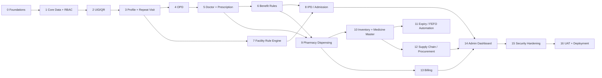

# Build Phases and Prompts

17 small phases (0–16), each scoped to be buildable and testable on its own before moving on. Each phase
lists: **scope**, **depends on**, **complexity**, **acceptance criteria** (how you know it's actually
done), **watch-outs** (the mistakes this phase is most likely to invite), and a **ready-to-paste prompt**
for an AI coding assistant (Claude Code, Cursor, etc.).

Copy one phase's prompt at a time into your AI coding assistant — don't paste the whole roadmap at once.
Complexity is a rough size signal (S/M/L), not a time estimate — actual time depends on team experience.

## Dependency order

Phases 7 (Facility Rule Engine) and 6 (Benefit Rules) can run in parallel with each other and with 4–5,
since neither depends on OPD or the doctor console — only on Phase 3 (profile) and Phase 1 (core data).
If you have two developers, this is the natural place to split work.

---

### Phase 0 — Foundations & environment
**Depends on:** nothing (first phase) · **Complexity:** S

**Scope:** monorepo skeleton, Docker Compose (postgres, redis), health check, CI lint/typecheck/test.

**Acceptance criteria**
- `docker compose up` starts postgres + redis with no manual steps.
- `GET /health` returns 200 from a running API instance.
- CI runs lint, typecheck and test on every PR and fails the build on any of the three failing.
- A new developer can go from `git clone` to a running local stack using only the steps in
  `02-tech-stack.md` §5.

**Watch-outs**
- Don't let this phase grow scope creep into actual entities/auth — it's infrastructure only. Resist the
  urge to "just add the User table while I'm here."
- Pin dependency versions (don't let `npm install` silently drift NestJS/Prisma major versions between
  developer machines).

**Prompt**
> Set up a monorepo for the ESIC Hospital Management System with `apps/api` (NestJS + TypeScript +
> PostgreSQL via Prisma) and `apps/web` (React + TypeScript + Vite + Tailwind). Add Docker Compose for
> postgres and redis. Add a `/health` endpoint. Add ESLint/Prettier and a GitHub Actions CI workflow that
> runs lint, typecheck and tests. No business logic yet — just a working skeleton I can run with
> `docker compose up`. Use the folder structure in `docs/02-tech-stack.md` §3 as the target layout.

---

### Phase 1 — Core data model & RBAC foundation
**Depends on:** Phase 0 · **Complexity:** M

**Scope:** Employee, PatientProfile, HospitalUID, EmploymentType, Post, Grade, User, Role, Permission,
AuditLog entities + migrations; JWT auth; RBAC guards; seed script for the 10 roles.

**Acceptance criteria**
- All entities from `docs/03-data-model.md` §1–2 exist as Prisma models with the exact fields/constraints
  listed (unique `employee_id`, one-to-one `HospitalUID`↔`Employee`, `Role.name` as a string column, not a
  database enum, with `is_system_role`).
- A seed script creates the 10 roles from `03-data-model.md` §1 with no manual database editing required,
  including `DataEntryOperator` seeded with `Employee` create/update permissions only (FR-SEC-13) — verified
  by a test that a Data Entry Operator token gets 403 on any FacilityEligibilityRule/BenefitRule/Prescription/
  BrandingConfig route.
- An authenticated request to a protected route without the right role returns 403, not 500 or silent
  success.
- Any POST/PUT/DELETE to a protected resource produces exactly one new `AuditLog` row.
- Login issues both an access token and a refresh token; an expired access token is rejected.
- Adding a new role (e.g., a test "Billing Clerk" role) is possible by inserting Role + Permission rows
  alone — no code change or redeploy required (FR-SEC-06).

**Watch-outs**
- This is the phase where RBAC gets designed once and reused everywhere after — don't special-case guards
  per-route; build one reusable `@Roles(...)` decorator + guard now, since every later phase depends on it.
- Audit logging bolted on later is much more expensive than building the interceptor now, even though
  there's little to audit yet.
- Don't model `Role.name` as a Prisma/Postgres enum — that reintroduces the "new role needs a migration"
  problem this phase is meant to solve. Use a string column with a uniqueness constraint instead.

**Prompt**
> In the NestJS API, add Prisma models for Employee, PatientProfile, HospitalUID, EmploymentType, Post,
> Grade, User, Role, Permission and AuditLog, matching the schemas in `docs/03-data-model.md` §1–2 exactly
> (unique constraint on Employee.employee_id, one-to-one HospitalUID-Employee, `Role.name` as a string
> column with `is_system_role`, not a hard-coded enum). Add JWT-based auth (access + refresh tokens) and a
> reusable `@Roles(...)` decorator + RBAC guard driven by Role/Permission. Seed the 10 roles: Reception,
> Doctor, Admission Desk, Nurse, Pharmacist, Store Manager, Procurement Officer, Data Entry Operator,
> Administrator, Super Admin — with Data Entry Operator scoped to create/update on Employee demographic
> fields only. Add an audit interceptor that writes an AuditLog row (actor, action, entity, before/after
> snapshot, timestamp) for every write to a protected resource. No UI yet — just the API and a migration I
> can run. Write tests that confirm (a) a request without the right role is rejected with 403, and (b) a
> Data Entry Operator is rejected on any facility-rule, benefit-rule, prescription or billing route.

---

### Phase 2 — Employee verification & UID/QR generation
**Depends on:** Phase 1 · **Complexity:** M

**Scope:** Employee ID verification interface (mocked Labour Dept API), UID generation, QR generation,
digital patient profile creation, printable UID card.

**Acceptance criteria**
- `LabourDeptClient` is an interface with a mock implementation returning realistic sample data; swapping
  in a real implementation later requires no change to calling code (see `01-architecture.md` §2.5).
- Registering the same Employee ID twice never creates two HospitalUID rows — verified with a concurrent
  double-submit test, not just a manual check.
- A failed verification creates a "Pending Manual Verification" case, not an HTTP error the front desk
  can't recover from (FR-EMP-02).
- The UID card view renders a scannable QR (verify by actually scanning it with a phone).

**Watch-outs**
- The most common bug here is a race condition on double-click registration — test it explicitly with two
  concurrent requests, don't rely on the UI debounce alone.
- Don't let "mock the Labour Dept API" become "hard-code the response shape into the registration logic" —
  keep the adapter interface real so swapping to a live integration in Phase 15 is a config change, not a
  rewrite.

**Prompt**
> Add an `EmployeeVerificationService` behind a `LabourDeptClient` interface (see
> `docs/02-tech-stack.md` §6 for the interface's role), with a mock implementation that returns name,
> department, post, grade, employment type and contact for a given Employee ID. On first-time
> registration: verify the Employee ID, create the Employee + PatientProfile, generate a unique Hospital
> UID (format `ESIC-{year}-{sequence}`), generate a QR code (`qrcode` package) encoding that UID, and
> return a printable UID card view (React). Follow the registration flow in `docs/07-functional-spec.md`
> Module 1. Reject registration if verification fails, with a manual-escalation status instead of a hard
> error. Add a test that fires two concurrent registration requests for the same Employee ID and asserts
> only one Hospital UID is created.

---

### Phase 3 — Patient profile & repeat visit
**Depends on:** Phase 2 · **Complexity:** S

**Scope:** UID/QR scan lookup, fetch profile + visit history, Visit entity, "create new visit."

**Acceptance criteria**
- UID lookup returns profile + visit history in a single request (see sample JSON in
  `docs/03-data-model.md` §13) — no N+1 round trips from the frontend.
- Creating a Visit from a looked-up profile requires zero re-entry of employee data.
- If an employee already has an open Visit, the UI warns before creating a second one (per
  `docs/07-functional-spec.md` Module 2 business rules).

**Watch-outs**
- Lookup must be strictly read-only — no code path in this phase should be able to mutate PatientProfile
  as a side effect of a lookup.

**Prompt**
> Add a UID/QR lookup endpoint (`GET /patients/lookup?uid=`) and screen: scanning or entering a UID
> fetches the PatientProfile plus previous visits, prescriptions, admissions and reports in one response
> (spec §5, `docs/03-data-model.md` §13 has a sample payload shape). Add a `Visit` entity (belongs to
> Employee, has a type of OPD or IPD, a status, and a created timestamp) and a "create new visit" action
> that lets reception pick Out Service or In Service next. Warn (don't block) if the employee already has
> an open Visit.

---

### Phase 4 — OPD (Out Service) module
**Depends on:** Phase 3 · **Complexity:** M

**Scope:** department selection, queue token generation, OPDVisit entity, token/queue display screen.

**Acceptance criteria**
- Token numbers are unique per department per calendar day, with no gaps or collisions under concurrent
  reception requests (test with parallel token-creation requests).
- Token counter resets at midnight without a manual/cron intervention beyond the natural date-scoped key.
- The queue display screen updates without a full page reload when a new token is called.

**Watch-outs**
- This is the phase where a naive "read count, add one, write" implementation will pass manual testing
  and fail under real concurrent load. Use Redis `INCR` per `department:date` key (see
  `01-architecture.md` §2.4), not a database read-then-write.

**Prompt**
> Add an `OPDVisit` entity linked to `Visit`, with department selection and an auto-incrementing daily
> queue token per department. Use Redis `INCR` on a `department:date` key for the counter — not a
> database read-then-write — so it's safe under concurrent reception requests. Add a reception screen to
> create an OPD visit and print/display the token, and a queue display screen doctors can use to call the
> next token, updating live via polling or a WebSocket. Follow spec §6.1 and
> `docs/07-functional-spec.md` Module 3. Add a test that fires 20 concurrent token-creation requests for
> the same department and asserts 20 unique, gapless token numbers.

---

### Phase 5 — Doctor console & digital prescription
**Depends on:** Phase 4 · **Complexity:** L

**Scope:** doctor's active-visit queue, medical history view, diagnosis/examination form, prescription
builder, test orders, admission recommendation flag, sign & submit.

**Acceptance criteria**
- A Draft prescription is editable only by its authoring doctor; a Signed prescription rejects any edit
  attempt at the API level (not just hidden in the UI).
- Signing requires the Doctor role — attempting to sign as any other role returns 403.
- Signing a prescription makes it visible to the pharmacy queue (Phase 9) in the same transaction, not a
  separate follow-up step that could be skipped.
- Flagging "admission recommended" creates an Admission request record ready for Phase 8 to consume, even
  though Phase 8 isn't built yet — the Diagnosis/Admission linkage should exist from this phase.

**Watch-outs**
- Don't let prescription editing "soft-unlock" after signing for convenience — immutability after signing
  is a compliance requirement (spec §17), not a UX nicety to relax later.
- Medical history view must be fast — this is a doctor waiting in front of a patient; lazy-load anything
  not needed for the first screen.

**Prompt**
> Build the doctor console: a queue of active visits (OPD tokens and ward rounds), a medical-history panel
> pulling prior visits/diagnoses/prescriptions for the selected patient, and a consultation form
> (symptoms, examination, diagnosis). Add `Prescription` and `PrescriptionItem` entities per
> `docs/03-data-model.md` §5 — items have medicine, dose, frequency and duration. Support adding lab
> tests, a follow-up flag, and an "admission recommended" flag that creates an Admission stub record.
> Submitting signs and locks the prescription (immutable after signing, enforced at the API level, not
> just the UI) and makes it visible to pharmacy. Only the Doctor role may sign. Follow spec §10.1 and
> `docs/07-functional-spec.md` Module 4.

---

### Phase 6 — Employment-type benefit rules
**Depends on:** Phase 3 (can run parallel to 4–5) · **Complexity:** S

**Scope:** BenefitRule entity, rule engine for permanent-vs-contractual medicine coverage, applied at
prescription and dispensing time.

**Acceptance criteria**
- `BenefitRuleService.evaluate(employmentType, medicine)` is the single implementation called from both
  the prescription screen and the pharmacy dispensing flow — grep the codebase for a second
  implementation and find none.
- The seeded default (Contractual → Paid, all categories) is a data row, editable through the same API an
  Administrator would use for any other rule — not a special-cased constant in code.
- Editing a rule does not retroactively change the `benefit_outcome` already recorded on past
  PrescriptionItems (history is immutable; only new evaluations use the new rule).

**Watch-outs**
- The single most likely mistake in this phase is writing the free/paid check twice (once for display,
  once for dispensing) and letting them drift. There must be exactly one service method.

**Prompt**
> Add a `BenefitRule` entity per `docs/03-data-model.md` §6 that maps EmploymentType (and optionally
> medicine category) to a coverage outcome: Free, Covered, or Paid. Add a single
> `BenefitRuleService.evaluate(employmentType, medicine)` method used by both the prescription screen (to
> show the employee what they'll pay) and the pharmacy dispensing flow (Phase 9) — do not duplicate this
> logic anywhere else. Seed the default: Contractual → Paid for all medicine categories (spec §7), as a
> normal editable data row, not a hard-coded branch, since ESIC/Labour Department policy can change it
> (spec §17). Follow `docs/07-functional-spec.md` Module 8.

---

### Phase 7 — Facility eligibility rule engine
**Depends on:** Phase 3 (can run parallel to 4–6) · **Complexity:** M

**Scope:** FacilityEligibilityRule entity + admin config screen, Ward/Room/Bed entities, eligibility
lookup service.

**Acceptance criteria**
- `FacilityEligibilityService.resolve(employeeId)` returns a category using only data-driven rule lookups
  — a code review should find no `if (post === '...')` branching anywhere in this service.
- Editing a rule creates a new version rather than overwriting the row (per `docs/03-data-model.md` §4);
  an admission decided under an old rule still shows which version it used.
- Only Administrator/Super Admin can reach the rule-editing screen and endpoint; any other role gets 403.
- The seeded rule table matches the provisional matrix in `docs/03-data-model.md` §12 — clearly marked as
  provisional pending the PRD's open question #2.

**Watch-outs**
- Resist the temptation to "just add one fast-path if statement for the common case" — that's exactly the
  hard-coding this phase exists to prevent (spec §9, §17).

**Prompt**
> Add `Ward`, `Room` and `Bed` entities (Bed belongs to Room belongs to Ward, Bed has a status of
> Available/Occupied/Maintenance) per `docs/03-data-model.md` §4. Add a `FacilityEligibilityRule` entity
> mapping Post/Grade to a facility Category (A/B/C/D/Contractual) per the table in spec §9.1, with
> versioning (editing creates a new version, not an overwrite). Add a
> `FacilityEligibilityService.resolve(employeeId)` that returns the eligible ward/room category using only
> data lookups — no hard-coded post/grade conditionals anywhere. Add an admin screen (Administrator/Super
> Admin only) to view and edit these rules. Follow `docs/07-functional-spec.md` Module 5.

---

### Phase 8 — IPD / admission management
**Depends on:** Phase 6, Phase 7 · **Complexity:** L

**Scope:** admission request from doctor recommendation, eligibility + availability check, allocation,
care-team assignment, daily notes, discharge summary, admission lifecycle.

**Acceptance criteria**
- Admission status only ever moves along the transitions in the state diagram
  (`01-architecture.md` §5.1) — an explicit test attempts an invalid transition (e.g.
  `Requested` → `Allocated` directly) and confirms it's rejected.
- Two concurrent allocation requests for the same bed: exactly one succeeds, the other receives a clean
  "bed no longer available" error, verified with a concurrency test — this is the single most important
  test in this phase (FR-ADM-03).
- Discharge requires a Doctor-role approval; a Nurse or Admin attempting to discharge directly is
  rejected.
- Discharging an admission frees its bed in the same database transaction — never a state where an
  admission is `Discharged` but the bed still shows `Occupied`.

**Watch-outs**
- This phase has the highest concurrency risk in the whole system. Don't ship bed allocation without an
  explicit concurrent-request test — "it worked when I clicked it manually" is not sufficient evidence.

**Prompt**
> Add an `Admission` entity with status Requested → EligibilityChecked → Allocated → UnderTreatment →
> DischargeApproved → Discharged (see the admission state diagram in `docs/01-architecture.md` §5.1 and
> schema in `docs/03-data-model.md` §4). When a doctor flags "admission recommended," create an Admission
> request. The admission desk screen calls `FacilityEligibilityService` to get the eligible category,
> lists available beds in that category, and allocates a specific bed — this must be transactional and
> enforced with a database-level unique constraint on `bed.current_admission_id`, never allowing two
> active admissions on one bed even under concurrent requests. Add a ward-staff screen for daily
> observation/treatment notes (`AdmissionNote`). Add a discharge flow: Doctor-role approval generates a
> `DischargeSummary` and frees the bed in the same transaction. Follow spec §8.1 and
> `docs/07-functional-spec.md` Module 6. Add a concurrency test: fire two simultaneous allocation requests
> for the same bed and assert exactly one succeeds.

---

### Phase 9 — Pharmacy & dispensing
**Depends on:** Phase 5, Phase 6 · **Complexity:** L

**Scope:** prescription queue for pharmacist, eligibility check, FEFO batch selection, dispense action,
partial issue, StockTransaction record.

**Acceptance criteria**
- FEFO batch selection is enforced by the service, not left to pharmacist choice — given multiple valid
  batches, the system always proposes the earliest-expiry one first.
- A batch with `stock_status = Expired` (or Quarantined/Disposed) never appears as dispensable, verified
  by a test that seeds an expired batch and confirms it's excluded from the dispense-options query
  (FR-PHM-07 — this is a patient-safety requirement).
- Every successful dispense produces exactly one `StockTransaction` row and decrements
  `MedicineBatch.current_stock` atomically — no dispense should be able to leave stock uncorrected if the
  transaction fails partway.
- Only the Pharmacist role can call the dispense endpoint.

**Watch-outs**
- The FEFO + expiry-block logic belongs in one query/service, reused by both the "show me batch options"
  read path and the "actually dispense" write path — don't let the UI-facing suggestion and the
  server-enforced rule diverge.

**Prompt**
> Build the pharmacist screen: a queue of signed prescriptions. Opening one shows patient, employment
> type, and each PrescriptionItem with live stock-by-batch, ordered by FEFO (earliest usable expiry
> first) — exclude any batch with stock_status Expired/Quarantined/Disposed from the options entirely, not
> just visually de-emphasized. Support an alternative batch or partial issue if the top batch has
> insufficient stock. Apply `BenefitRuleService` (Phase 6) to mark each item free/covered/paid. Dispensing
> deducts inventory and writes an append-only `StockTransaction` row inside the same database transaction,
> and marks the prescription (or item) closed or partially closed. Only the Pharmacist role may dispense.
> Follow spec §11.1 and `docs/07-functional-spec.md` Module 7. Add a test seeding an expired batch and
> confirming it never appears in dispense options.

---

### Phase 10 — Inventory & medicine master
**Depends on:** Phase 9 · **Complexity:** M

**Scope:** Medicine, MedicineBatch, PharmacyStock entities with the full field set from spec §13, minimum
and reorder level config.

**Acceptance criteria**
- All fields from `docs/03-data-model.md` §7 exist on MedicineBatch, with `expiry_date` indexed (Phase 11
  will query it daily).
- The inventory screen's stock-status column matches `MedicineBatch.stock_status` exactly — no separate
  UI-computed status that could drift from the stored value.

**Watch-outs**
- This phase is mostly CRUD, but get the field list exactly right the first time — several later phases
  (11, 12) depend on these fields existing with these exact names/types.

**Prompt**
> Add `Medicine` and `MedicineBatch` entities exactly matching the field lists in
> `docs/03-data-model.md` §7 (generic name, brand name, category, strength, dosage form for Medicine;
> batch number, manufacturer, supplier, manufacturing date, expiry date — indexed, purchase price, issue
> price, current stock, minimum stock level, reorder level, storage location, stock_status enum for
> MedicineBatch) per spec §13. Add `PharmacyStock` linking batches to CentralStore or Pharmacy location.
> Add an inventory screen listing medicines with current stock, batches, and stock status (In Stock / Low
> / Out / Expiring / Expired), reading `stock_status` directly rather than recomputing it in the frontend.

---

### Phase 11 — Expiry & FEFO automation
**Depends on:** Phase 10 · **Complexity:** M

**Scope:** scheduled daily scan, 90-day/30-day alert thresholds, auto-block on expiry, quarantine,
disposal approval and audit trail.

**Acceptance criteria**
- The scheduled job runs daily without manual triggering, and is idempotent — running it twice on the
  same day doesn't double-flag or double-notify.
- A batch crossing the 90-day threshold moves to EarlyWarning; crossing 30 days moves to CriticalAlert;
  crossing the expiry date moves to Expired → Quarantined automatically, verified by tests that seed
  batches at each boundary.
- Disposal requires an explicit approval action and produces an AuditLog entry — there is no code path
  where a batch reaches `Disposed` status without both.

**Watch-outs**
- Test the boundary conditions explicitly (exactly 90 days, exactly 30 days, exactly the expiry date) —
  off-by-one errors here directly affect patient safety and stock write-off accuracy.

**Prompt**
> Add a BullMQ scheduled job that runs daily: scans MedicineBatch expiry dates, flags batches expiring
> within 90 days as Early Warning and within 30 days as Critical Alert, and automatically transitions any
> batch past its expiry date to Expired then Quarantined, blocking it from the dispense-options query used
> in Phase 9. Add a disposal workflow requiring approval (Store Manager or Administrator), and record the
> disposal with a full AuditLog entry — no code path should be able to mark a batch Disposed without an
> approval record. Follow spec §14.1 and the medicine-batch state diagram in
> `docs/01-architecture.md` §5.2. Add tests for the exact 90-day, 30-day and expiry-date boundaries, and a
> test confirming the job is idempotent if run twice in one day.

---

### Phase 12 — Supply chain & procurement
**Depends on:** Phase 10 · **Complexity:** L

**Scope:** low-stock alert, PurchaseRequisition, Approval, PurchaseOrder, Supplier, GoodsReceiptNote,
StoreTransfer.

**Acceptance criteria**
- A PurchaseOrder can only be created referencing a PurchaseRequisition with an `Approval.decision =
  Approved` row — attempting to skip approval is rejected at the service layer (FR-SCM-03).
- Confirming a GoodsReceiptNote creates new MedicineBatch rows with all required fields populated
  (batch number, expiry date, etc.) and increases central store stock — verified end-to-end from GRN
  submission to stock query.
- A StoreTransfer decreases CentralStore PharmacyStock and increases Pharmacy PharmacyStock for the same
  batch, atomically.

**Watch-outs**
- The approval-before-PO rule is easy to bypass accidentally if the PO creation endpoint doesn't itself
  check for the Approval row — don't rely on the UI hiding the "create PO" button as the only enforcement.

**Prompt**
> Add `Supplier`, `PurchaseRequisition`, `Approval`, `PurchaseOrder` and `GoodsReceiptNote` entities per
> `docs/03-data-model.md` §8. When a medicine's stock drops below its `reorder_level`, auto-generate a
> low-stock alert visible to the Store Manager, who can raise a PurchaseRequisition (manually or from the
> alert). Add an approval workflow — a PurchaseOrder can only be created from a Requisition that has an
> Approved `Approval` record, enforced at the service layer, not just hidden in the UI. On receipt, the
> Store Manager records a GoodsReceiptNote (quality/quantity/batch/expiry verification per line item)
> which creates new MedicineBatch rows and adds stock to the central store. Add a StoreTransfer action to
> move stock from central store to hospital pharmacy, atomically decreasing one PharmacyStock row and
> increasing another. Follow spec §12.1 and `docs/07-functional-spec.md` Module 10.

---

### Phase 13 — Billing & benefit ledger
**Depends on:** Phase 9 · **Complexity:** S

**Scope:** BillingTransaction entity, free vs paid line items, receipt for paid medicine purchases.

**Acceptance criteria**
- Every dispensed PrescriptionItem produces exactly one BillingTransaction row, created in the same
  transaction as the dispense (Phase 9), not as an async follow-up that could be missed.
- Paid transactions use `MedicineBatch.issue_price` at the time of dispensing, not a live-recomputed price
  that could change retroactively.
- A receipt PDF is generated and downloadable for Paid transactions.

**Watch-outs**
- Don't build toward a payment gateway "just in case" — v1 is explicitly a ledger + printed receipt (PRD
  scope boundary); adding payment-gateway scaffolding here is scope creep.

**Prompt**
> Add a `BillingTransaction` entity per `docs/03-data-model.md` §9, recording, per dispensed
> PrescriptionItem, whether it was free, covered or paid, and the amount charged for paid items (using
> `issue_price` from the dispensed MedicineBatch, captured at dispense time). Create this row in the same
> transaction as the dispense action from Phase 9. Generate a simple receipt (PDF) for contractual
> employees who purchase medicine. This is a ledger, not a payment gateway — cash/counter payment is
> assumed for this phase; do not add payment processing scaffolding.

---

### Phase 14 — Admin dashboard & analytics
**Depends on:** Phase 8, Phase 12, Phase 13 · **Complexity:** M

**Scope:** the widgets listed in spec §19, using Recharts.

**Acceptance criteria**
- Every widget in `docs/06-requirements.md` FR-DSH group is present, reading live data — no widget is a
  static/mock placeholder at the end of this phase.
- Dashboard queries are read-only aggregates; running the dashboard has zero write side effects (an
  explicit test: hitting every dashboard endpoint produces no new rows anywhere).
- Data shown is no more than ~5 minutes stale (per NFR-PERF target in the requirements doc) — note the
  refresh mechanism used (polling interval, cache TTL) in the PR description.

**Watch-outs**
- Resist adding write actions "while I'm in this screen" (e.g., a quick-approve button) — this phase is
  read-only by design; write actions belong to their owning module's screen.

**Prompt**
> Build an admin dashboard with: daily OPD visits and waiting queue, current admissions and bed occupancy,
> admissions by employee category/post, low-stock and out-of-stock medicines, medicines expiring in 90/30
> days, expired/quarantined stock, pending requisitions and approvals, open purchase orders and delayed
> suppliers, medicine consumption by department and period, permanent-vs-contractual utilization, and
> prescription/dispensing audit exceptions. Every widget is a read-only aggregate query — no write
> endpoints in this phase. Follow spec §19 and `docs/06-requirements.md` FR-DSH group exactly as the
> widget list.

---

### Phase 15 — Security hardening, governance & system configuration
**Depends on:** Phase 14 · **Complexity:** L

**Scope:** full RBAC audit, TLS, field-level access restriction on medical records, session controls,
backup/recovery runbook, secured Labour Dept integration, application security hardening (XSS/CSRF/security
headers/password policy/MFA), security governance program (VAPT + incident response plan + lower-environment
data masking), and the Super-Admin-only system configuration & branding screen (Module 14).

**Acceptance criteria**
- A role-by-endpoint matrix is produced (e.g. a spreadsheet or table) covering every route in the API for
  all 10 roles, and every gap found is closed — this matrix is a deliverable of the phase, not just an
  implicit check.
- Attempting cross-role actions (Nurse editing billing, Pharmacist editing a diagnosis, Data Entry Operator
  touching a facility/benefit rule or BrandingConfig) is rejected with 403 at the API level for every such
  case in the matrix, verified by tests.
- Session timeout on inactivity and a concurrent-session limit are enforced and tested; changing a password
  invalidates all other active sessions (FR-SEC-12).
- Every response carries HSTS, CSP, X-Content-Type-Options and X-Frame-Options headers, verified by an
  automated header-assertion test (FR-SEC-09).
- CSRF tokens are required and validated on every state-changing route (FR-SEC-08).
- Password policy (complexity + breach-list check) and account lockout after N failed attempts are enforced
  and tested (FR-SEC-10); Super Admin and Administrator accounts cannot use their edit permissions until
  TOTP MFA is enrolled (FR-SEC-11).
- `BrandingConfig` read/write endpoints exist; only Super Admin can write, every write is audit-logged, and
  the UI/print templates render the default ESIC logo when unset (FR-CFG-01 to FR-CFG-03).
- A documented, tested backup/recovery runbook exists for Postgres — "tested" meaning a restore has
  actually been performed against a copy, not just documented in theory.
- `LabourDeptClient`'s real implementation reads credentials from a secrets manager, never from source
  control or a plain `.env` committed to the repo.
- A Security Incident Response Plan document exists (severity classification, escalation matrix, breach
  notification timeline) and a VAPT engagement is scheduled/booked — these are governance deliverables of
  this phase, not deferred to "later."
- Dev/staging environment refresh scripts run production data through a masking/synthetic-data step before
  load — verified by confirming no real Employee/PatientProfile PII appears in a fresh staging refresh.

**Watch-outs**
- This phase is where "we'll get to it later" security gaps from earlier phases surface — budget time to
  actually fix findings, not just document them.
- Security headers and CSRF protection are easy to add but easy to get subtly wrong (e.g., a CSP that still
  allows `unsafe-inline`, a CSRF check that only fires on some routes) — test the negative case (header/token
  missing or wrong) explicitly, not just the happy path.

**Prompt**
> Produce a role-by-endpoint permission matrix for all 10 roles across every API route, and close any gap
> (e.g. a nurse should not be able to edit billing; a pharmacist should not be able to edit a diagnosis; a
> data entry operator should not be able to touch facility/benefit rules or branding config) — add a test
> per gap found. Add row/field level restriction so medical record detail is only visible to roles that
> need it. Add session timeout, a concurrent-session limit, and password-change session invalidation, with
> tests. Add server-side input validation/output encoding on every mutating endpoint, CSRF tokens on
> state-changing routes, and HSTS/CSP/X-Content-Type-Options/X-Frame-Options headers on every response —
> add tests asserting these headers/tokens. Add a password policy (complexity + breached-password check)
> with account lockout, and TOTP MFA gating edit permissions for Super Admin/Administrator. Add a
> `BrandingConfig` module (`GET/PUT /config/branding`) writable only by Super Admin and audit-logged, per
> `docs/03-data-model.md` §1a and `docs/07-functional-spec.md` Module 14, with a default-logo fallback.
> Document and test a backup and recovery runbook for Postgres (actually perform a restore against a copy).
> Move the `LabourDeptClient` mock to a real client with credentials read from a secrets manager, over TLS.
> Write a Security Incident Response Plan doc and a data-masking script for non-production refreshes. Follow
> spec §20 and `docs/06-requirements.md` NFR-SEC / FR-SEC / FR-CFG groups.

---

### Phase 16 — Integration testing, UAT & deployment
**Depends on:** Phase 15 · **Complexity:** L

**Scope:** E2E tests covering the master flow (spec §15), staging deployment, monitoring, UAT checklist
per role.

**Acceptance criteria**
- Playwright E2E tests cover, at minimum: new registration → OPD visit → prescription → dispensing, and
  separately admission → allocation → discharge, both passing reliably in CI (not flaky).
- Staging deployment happens automatically from the CI pipeline on merge to main.
- Prometheus/Grafana show live bed occupancy, queue depth and stock-level metrics from the staging (or
  prod) environment.
- A UAT checklist exists with one section per role and is signed off by a real representative of each
  role before production go-live — this is a human sign-off, not just a test suite passing.

**Watch-outs**
- Don't treat "tests pass" as equivalent to "UAT sign-off" — the checklist exists specifically because
  automated tests won't catch every real-world workflow friction a nurse or pharmacist will notice in five
  minutes of actual use.

**Prompt**
> Write Playwright E2E tests covering the master flow in spec §15.1: new employee registration → OPD visit
> → prescription → pharmacy dispensing, and separately admission → bed allocation → discharge. Set up
> staging deployment via the CI pipeline from Phase 0, wire up Prometheus/Grafana for bed occupancy, queue
> depth and stock-level metrics, and produce a UAT checklist with one section per role (Reception, Doctor,
> Admission Desk, Nurse, Pharmacist, Store Manager, Procurement Officer, Data Entry Operator, Administrator,
> Super Admin), covering every acceptance criterion listed for that role's phases in this document.
